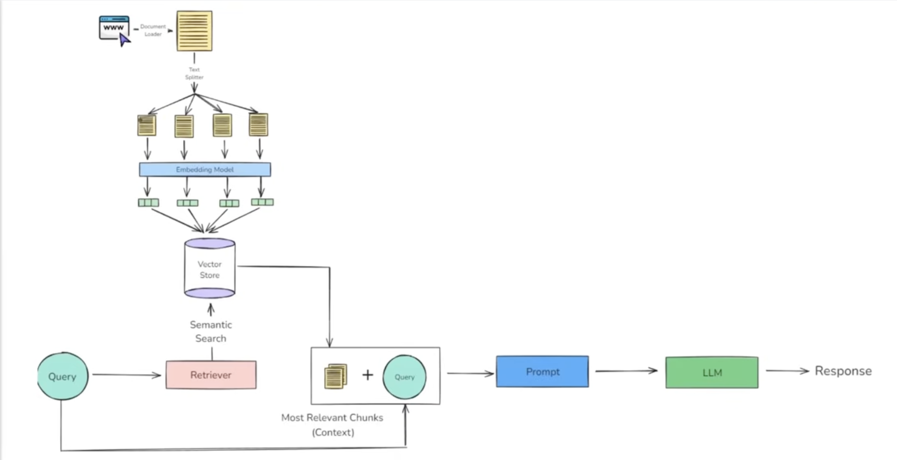

# YouTube RAG Chatbot (LangChain)

This project implements a **Retrieval-Augmented Generation (RAG)** based chatbot that can answer user questions using information retrieved from YouTube video transcripts.

The system uses semantic search over vector embeddings to fetch the most relevant context and then generates responses using a Large Language Model (LLM).

---

## Architecture Overview

The overall flow of the system is shown below:



**Pipeline (RAG):**
1. **Indexing**
   - Document loading (YouTube transcript)
   - Text splitting
   - Embedding generation
   - Vector storage (FAISS)
2. **Retrieval**
   - Semantic search over the vector store
3. **Augmentation**
   - Combine retrieved context with user query
4. **Generation**
   - LLM generates the final answer

---

## Tech Stack

- **LangChain** – Orchestration framework
- **HuggingFace Embeddings** – Open-source text embeddings
- **FAISS** – Vector storage and similarity search
- **OpenAI API** – LLM for answer generation (replaceable)
- **Python**
- **VS Code**
- **Virtual Environment**

---

## Project Structure

```text
rag/
│
├── data/
│   └── plan_of_action.png   # Architecture diagram
│
├── run.py                  # Main execution script
├── requirements.txt
├── .env                    # API keys (not committed)
└── README.md
```

## Setup Instructions
### 1.Create Virtual Environment
```bash
python3 -m venv venv
source venv/bin/activate   # macOS / Linux
```
### 2.Install Dependencies
```bash
pip install -r requirements.txt
```

## Environment Variables
Create a .env file in the project root:
```bash
OPENAI_API_KEY="your_api_key_here"
```

## How It Works
1.YouTube transcripts are loaded as documents.     
2.Text is split into smaller chunks.    
3.Each chunk is converted into a vector embedding.  
4.Vectors are stored in a vector database.  
5.A user query is embedded and matched against stored vectors.  
6.Most relevant chunks are retrieved.  
7.Retrieved context is combined with the user query (augmentation).   
8.The LLM generates the final answer based only on this context.

## Running the Project
```bash
python run.py
```

## Note
Vector search in this project operates independently of the LLM, allowing the retrieval pipeline to function even without an API key. The primary focus of this implementation is to understand and build the complete Retrieval-Augmented Generation (RAG) workflow, from document ingestion and semantic search to context-aware response generation.

